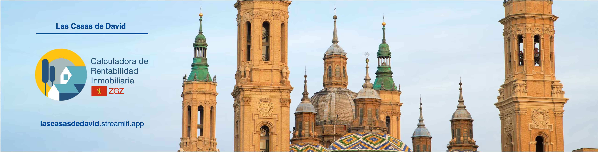

## Descripción

El proyecto **"Modelo predictivo de la rentabilidad de la compra de una vivienda para alquiler utilizando Machine Learning"** tiene como objetivo principal analizar la rentabilidad de invertir en viviendas, considerando precios de venta, alquiler y el estado de las propiedades. Utiliza datos obtenidos de APIs, procesados y almacenados en MongoDB, y modelos de machine learning para la estimación del alquiler y evaluación del estado de cocinas y baños. Los resultados se pueden consultar a través de una interfaz interactiva de Streamlit.

El cliente objetivo de este proyecto son pequeños y medianos inversores, que tienen interés en aumentar su patrimonio inmobiliario, pero se enfrentan a la dificultad del tiempo y la complejidad de seguir y filtrar las oportunidades que aparecen periódicamente en el mercado.

Con esta herramienta, el usuario será capaz de obtener una visión general y específica de las oportunidades disponibles en una ciudad determinada. En este caso, por su crecimiento y características particulares, hemos elegido a Zaragoza.


## Objetivos
1. **Recopilación y análisis de datos inmobiliarios**
-	Obtener precios de compra y alquiler de viviendas mediante la API de idealista.
-	Extraer imágenes de las propiedades para su posterior análisis automatizado.

2. **Evaluación de las condiciones de las propiedades**
-	Implementar un modelo de reconocimiento de imágenes para identificar cocinas y baños en las imágenes de las propiedades.
-	Utilizar otro modelo preentrenado para evaluar el estado de estos espacios y determinar si requieren renovaciones.

3. **Análisis de rentabilidad**
-	Predecir el precio del alquiler de las viviendas en venta utilizando un modelo de ML.
-	Calcular la rentabilidad esperada para cada vivienda en alquiler, utilizando métricas como el beneficio y rentabilidad neta, ROCE y COCR en años y porcentaje.
-	Comparar los resultados para identificar la opción más beneficiosa en cada caso.

4. **Gestión y presentación de datos**
-	Almacenar toda la información recopilada en una base de datos de Mongo para facilitar consultas y análisis espacial.
-	Creación de mapas interactivos y gráficos para mostrar la distribución de las propiedades y su rentabilidad.


## Tabla de Contenidos

- [Requerimientos](#requerimientos)
- [Dependencias](#dependencias)
- [Estructura del Repositorio](#estructura-del-repositorio)
- [Instalación](#instalación)
- [Uso](#uso)
- [Aplicación](#aplicación)
- [Informe Final](#informe-final-y-próximos-pasos)
- [Próximos Pasos](#próximos-pasos)
- [Contacto](#contacto)

## Requerimientos

- **Sistema Operativo:** Windows, macOS o Linux.
- **Python:** Versión 3.9 o superior.
- **MongoDB:** Base de datos utilizada para almacenar los datos procesados.

## Dependencias

Este proyecto requiere las siguientes librerías:

- pandas
- numpy
- transformers
- Pillow
- requests
- tqdm
- matplotlib
- seaborn
- scipy
- statsmodels
- category_encoders
- scikit-learn
- geopandas
- shapely
- pymongo
- dotenv
- xgboost
- numpy_financial
- ultralytics
- anthropic

Las dependencias están listadas en `requirements.txt` para la instalación con pip.

## Estructura del Repositorio

```
Proyecto-Rentabilidad-Viviendas/
└── davfranco1-proyecto-rentabilidad-viviendas/
    ├── data/
    │   ├── descripcion_variables.md
    │   ├── images
    │   ├── raw/
    │   │   ├── distritos_zaragoza.json
    │   │   ├── ejemplos_venta_id.pkl
    │   │   ├── idealista-rent.json
    │   │   ├── idealista-sale.json
    │   │   ├── idealista_rent.csv
    │   │   └── idealista_sale.csv
    │   └── transformed/
    │       ├── final_rent.pkl
    │       ├── final_sale.pkl
    │       ├── final_tags.pkl
    │       ├── gdf_distritos.geojson
    │       ├── idealista_rent.geojson
    │       └── idealista_sale.geojson
    ├── demo480.mov
    ├── InformeFinal.pdf
    ├── notebooks/
    │   ├── 1_Extraccion.ipynb
    │   ├── 2_TransformacionPreprocesamiento.ipynb
    │   ├── 3_Modelos.ipynb
    │   └── 4_CalculoRentabilidad.ipynb
    ├── PPTFinal.pdf
    ├── requirements.txt
    ├── src/
    │   ├── soporte_blip.py
    │   ├── soporte_encoding.py
    │   ├── soporte_estadistica.py
    │   ├── soporte_extraccion.py
    │   ├── soporte_modelos.py
    │   ├── soporte_mongo.py
    │   ├── soporte_preprocesamiento.py
    │   ├── soporte_rentabilidad.py
    │   ├── soporte_scaling.py
    │   ├── soporte_scoring.py
    │   └── soporte_yolo.py
    └── transformers/
        ├── model.pkl
        ├── scaler.pkl
        ├── target_encoder.pkl
        ├── yolo11l-cls.pt
        ├── yolo11m-cls.pt
        ├── yolo11s-cls.pt
        ├── yolo11x-cls.pt
        ├── yolov8m.pt
        └── yolov8n.pt
```

## Instalación

Para configurar el entorno, sigue estos pasos:

1. **Clonar el repositorio:**
   ```bash
   git clone https://github.com/davfranco1/Proyecto-Rentabilidad-Viviendas.git
   cd Proyecto-Rentabilidad-Viviendas
   ```

2. **(Opcional) Crear y activar un entorno virtual:**
   ```bash
   python -m venv env
   source env/bin/activate  # En macOS/Linux
   env\Scripts\activate  # En Windows
   ```

3. **Instalar dependencias con pip:**
   ```bash
   pip install -r requirements.txt
   ```

4. **Crear un archivo para los secretos:**
   En la carpeta `src` del proyecto, crea `.env` y añade las claves necesarias:
   ```bash
   anthropic_key=tu_api_key_de_anthropic
   rapidapi_key=tu_api_key_de_rapidapi
   geoapify_key=tu_api_key_de_geoapify
   MONGO_URI=tu_uri_de_mongo
   ```
   Si deseas desplegar una aplicación similar en la nube de Streamlit, debes almacenar estos *secrets* en la configuración de la aplicación.
   **Asegúrate de añadir el archivo `.env` al `.gitignore` del proyecto**, de modo que, tus secrets permanezcan seguros.


## Uso
A continuación, resumimos algunos de los principales pasos involucrados en la ejecución del proyecto. La lógica del proyecto se puede seguir a través de los Jupyter Notebooks, que están numerados para su ejecución, mientras que, las funciones principales se encuentran en los archivos de soporte `.py`.

Para ejecutar el proyecto será necesario:
- Obtener una API Key de [Geoapify](https://www.geoapify.com).
- Obtener una API Key de idealista en [Rapidapi](https://rapidapi.com/scraperium/api/idealista7).
- Crear una cuenta en [Mongo Atlas](https://www.mongodb.com/lp/cloud/atlas/try4-reg), una base de datos y obtener la 'MONGO_URI'.
- Obtener una API Key para [Anthropic](https://www.anthropic.com/api) y [OpenAI](https://platform.openai.com/docs/overview) (para el chatbot).

Mientras Mongo Atlas y Geoapify ofrecen opciones gratuitas para uso básico, será necesario pagar por créditos en el resto de plataformas. Asegúrate de conocer los precios de los tokens y las llamadas antes de ejecutar el proyecto.

### 1. Extracción de Datos

Se obtienen datos de:
- **API Geoapify**: Datos geográficos de Zaragoza (`setl.geoconsulta_distritos()`).
- **API Idealista**: Información de viviendas en venta y alquiler (`setl.consulta_idealista()`).

Ejemplo de ejecución:
```python
from src import soporte_extraccion as setl
resultados_idealista_sale = setl.consulta_idealista("sale", "0-EU-ES-50-17-001-297", "Zaragoza", "60000", "150000", 12)
```

### 2. Procesamiento de Datos

- Conversión de datos geoespaciales con `geopandas`.
- Carga en MongoDB:
  ```python
  from src import soporte_mongo as sm
  bd = sm.conectar_a_mongo("ProyectoRentabilidad")
  sm.subir_geodataframe_a_mongo(bd, gdf_distritos, "distritos")
  ```

### 3. Modelado y Predicción

- **Predicción de alquiler con Machine Learning**:
  ```python
  from src import soporte_rentabilidad as sr
  paths_transformers = ["../transformers/target_encoder.pkl", "../transformers/scaler.pkl", "../transformers/model.pkl"]
  gdf = sr.predecir_alquiler(gdf, paths_transformers)
  ```

- **Identificación de imágenes con YOLO**:
  ```python
  from src import soporte_yolo as sy
  gdf, detecciones = sy.identificar_urls_habitaciones(gdf, 'urls_imagenes', drop_nulls=True)
  ```

- **Análisis de imágenes con BLIP**:
  ```python
  from src import soporte_blip as sb
  captions_cocinas = sb.generar_descripciones(gdf, 'url_cocina')
  ```

- **Evaluación de estado de cocinas y baños con Anthropic**:
  ```python
  from src import soporte_scoring as ss
  gdf, resultados = ss.analizar_propiedades(gdf, batch=3)
  ```


##  Aplicación

Este repositorio contempla el *backend* del proyecto, mientras que, la interfaz del usuario se ha creado a través de una aplicación Streamlit, que está disponible en [este repositorio](https://github.com/davfranco1/Streamlit-Viviendas) para ejecución en local.

**☁️ También disponible en Streamlit Cloud ☁️**: Se puede acceder a la aplicación a través de la URL https://lascasasdedavid.streamlit.app.

<video width="640" height="400" controls>
  <source src="demo480.mp4" type="video/mp4">
  Your browser does not support the video tag.
</video>

🎥 [Enlace a demo en video](https://github.com/davfranco1/Proyecto-Rentabilidad-Viviendas/blob/main/demo480.mp4)


## Informe final y próximos pasos

- Un informe completo sobre el desarrollo de este proyecto está disponible para descargar [aquí](InformeFinal.pdf).
- También disponible una presentación de diapositivas [aquí](PPTFinal.pdf).


## Contacto

Para dudas, sugerencias o contactar conmigo:

- [**GitHub**](https://github.com/davfranco1)
- [**LinkedIn**](linkedin.com/in/franco-david)


## Lo importante 🌴

Este proyecto se lo dedico a mis profesores y compañeros de la *generación Data Science del 24'*, por una etapa tan intensa pero tan especial como la que hemos compartido... incontables horas "frikeando" que me han redescubierto el emocionante mundo del dato. ¡Que pasada haberos conocido!

Debo agradecer también a mi gran amigo David, por haberme ayudado a construir esta idea mientras paseábamos una mañana por El Retiro, y por su invaluable apoyo durante todo el proceso.
